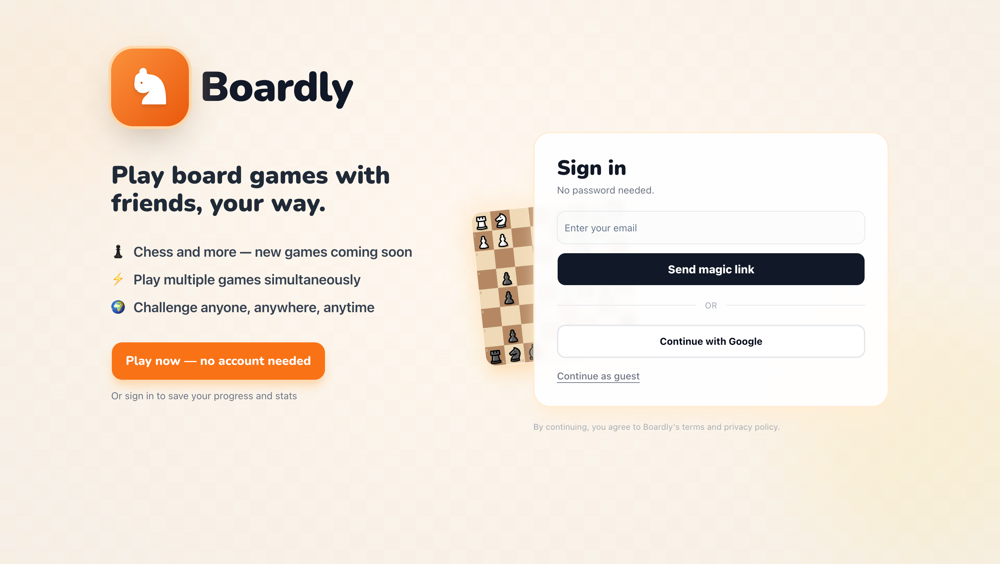
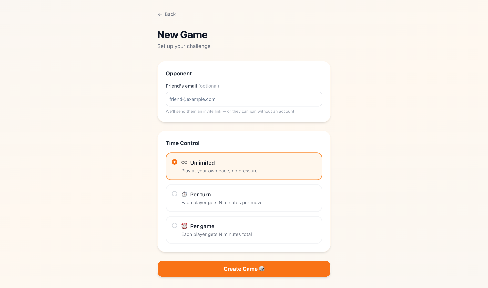
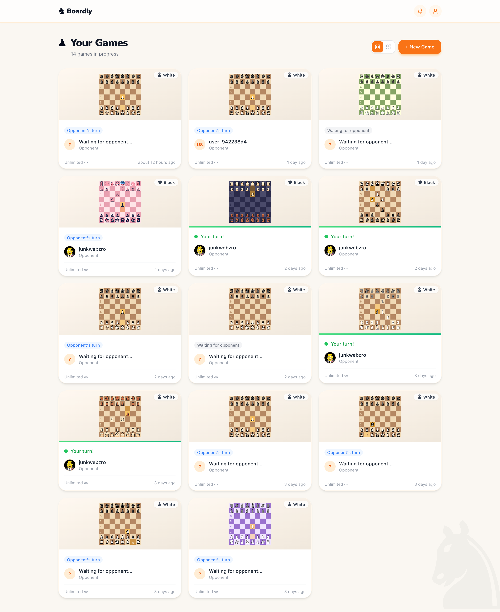
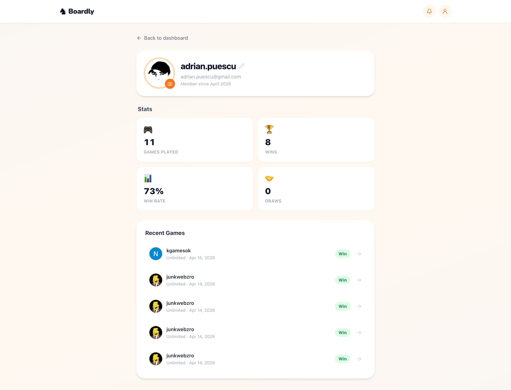

# Boardly

Turn-based board games in the browser—**chess first**, more games later. Built as a full-stack portfolio piece: real auth, realtime sync, invites, and a polished UI.

**Live:** [boardly.webz.ro](https://boardly.webz.ro) · **Stack:** Next.js 14 · TypeScript · Supabase · Tailwind

---

## Why it exists

Small scope, production-minded choices: **Row Level Security** on Postgres, **Supabase Realtime** for live boards, **Route Handlers** for game logic, and **i18n** (EN / ES / RO) so the product isn’t English-only by accident.

---

## Screenshots

Each screen has its own image so you can show **different pages** without cramming everything into one picture. Files live in [`docs/screenshots/`](docs/screenshots/) as **PNG**. Commit real captures over the cream/orange placeholders when you’re ready.

### Login

Magic link + Google OAuth entry point (`/login`).



### Lobby

Start a game: time control and matchmaking (`/lobby`).



### Dashboard

Active games grid (`/dashboard`).



### Live game

In-game board, clocks, and navbar (`/game/[id]`).

![Live game — /game/[id]](docs/screenshots/game.png)

### Profile

Account / preferences (`/profile`).



See [`docs/screenshots/README.md`](docs/screenshots/README.md) for a filename ↔ route map and capture tips.

---

## Tech stack

| Area | Choices |
|------|---------|
| **App** | Next.js 14 (App Router), React 18, TypeScript |
| **UI** | Tailwind CSS, Radix / shadcn-style primitives, Framer Motion |
| **Data & auth** | Supabase (Postgres, Auth, Realtime), `@supabase/ssr` |
| **Chess** | chess.js, react-chessboard |
| **Validation** | Zod |
| **Email** | Resend (where configured) |
| **i18n** | next-intl |

---

## Architecture (short)

- **Client:** Supabase anon client in the browser; session via cookies (SSR-safe patterns).
- **Server:** Service role only in Route Handlers / server code that must bypass RLS—never exposed to the client.
- **Realtime:** Subscriptions for moves and game state so both players see updates without polling.
- **API:** REST-style Route Handlers under `app/api/` for games, moves, invites, notifications, etc.

---

## Getting started

```bash
git clone https://github.com/adrianpuescu/boardly.git
cd boardly
npm install
cp .env.local.example .env.local
```

Fill `.env.local` using your [Supabase API settings](https://supabase.com/dashboard/project/_/settings/api) (see table below).

### Database

Apply SQL migrations **in order** from `supabase/migrations/` in the Supabase SQL editor (or via [Supabase CLI](https://supabase.com/docs/guides/cli)):

`001` → `002` → `003` → `004` → `005` → `006` → `007`

### Run locally

```bash
npm run dev
```

Open [http://localhost:3000](http://localhost:3000).

```bash
npm run build   # production build
npm run lint    # ESLint
```

---

## Environment variables

| Variable | Purpose |
|----------|---------|
| `NEXT_PUBLIC_SUPABASE_URL` | Supabase project URL |
| `NEXT_PUBLIC_SUPABASE_ANON_KEY` | Public anon key (client + server helpers) |
| `SUPABASE_SERVICE_ROLE_KEY` | **Secret.** Server-only; bypasses RLS—never commit real values |
| `NEXT_PUBLIC_APP_URL` | Canonical app URL (metadata, links; e.g. `http://localhost:3000` or your production domain) |

Optional for full features (email, cron): `RESEND_API_KEY`, `CRON_SECRET`—see code under `app/api/` and `lib/resend.ts` where used.

---

## Features (high level)

- **Auth** — Google OAuth and magic link (Supabase Auth)
- **Dashboard** — Multiple active games
- **Live play** — Moves synced with Supabase Realtime
- **Time controls** — Unlimited, per-turn, or per-game clocks
- **Invites** — Shareable join links; email flow where Resend is configured
- **Themes & preferences** — Board themes and related user prefs (see migrations `005`–`006`)
- **Guests** — Anonymous access paths where enabled (migration `007` + product logic)

---

## Project structure

```text
app/
  (auth)/login/           Magic link + OAuth
  (protected)/            Authenticated routes (dashboard, lobby, game, profile)
  api/                    Route Handlers (games, moves, invites, notifications, OG image, …)
  auth/callback/          OAuth / magic-link return
components/
  game/                   Board, cards, timers, dashboard shell
  layout/                 Navbar, shared chrome
  ui/                     Reusable UI primitives
hooks/                    Realtime, timers, board theme, …
i18n/                     next-intl wiring
lib/                      Supabase clients, types, email, utilities
messages/                 Translation JSON (en, es, ro)
middleware.ts             Locale + auth session refresh
supabase/migrations/      Ordered SQL migrations
```

---

## For recruiters

This repo is meant to demonstrate **readable structure**, **typed APIs**, **security-aware Supabase usage** (RLS + scoped service role), and **shipping a cohesive UX** (motion, i18n, responsive layout). Clone it, run `npm install` and `npm run dev`, and trace a move from the chess UI → API route → Postgres.

---

## License

[MIT](LICENSE) — see the `LICENSE` file.

## Security

See [SECURITY.md](SECURITY.md) for how to report vulnerabilities responsibly.
